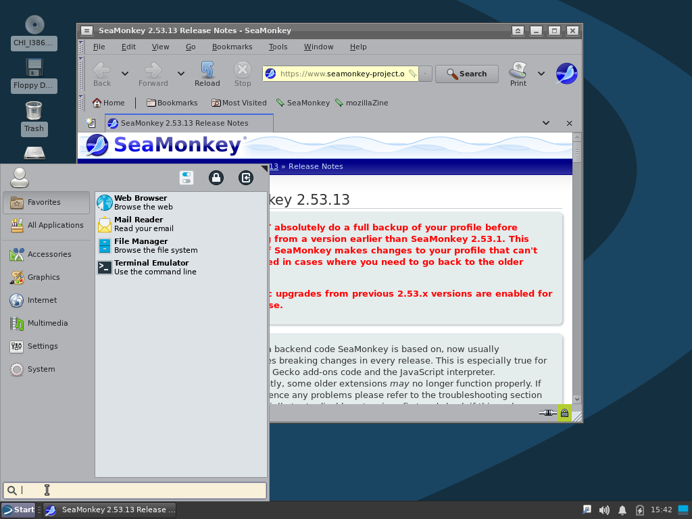

# windvn

Devuan Linux for Windows users  
<a href="//git.lumen.sh/Fierelier/windvn/raw/branch/master/assets/screenshot.png" target="_blank"></a>

# [Download](https://fier.me/software/windvn/iso/chimaera)

Regular ISOs have a full live environment. The desktop environment can be started by going into bash, and typing `startx`. Legacy ISOs only have a text live environment.

If you want to know what commandlines are used for the ISOs, read path/wdvn-makeall.

**NOTE 1:** [Debian is looking to *basically* end support for 32-bit x86 architectures in their next major release](https://dev1galaxy.org/viewtopic.php?id=6266) ([Alternate source](https://release.debian.org/trixie/arch_qualify.html)). [This, by extension, also extends to Devuan](https://dev1galaxy.org/viewtopic.php?pid=47335#p47335), and as such also windvn. Because of this, Devuan 5 (Daedalus) is the last major release I will support with windvn. *Once mainstream support ends for Daedalus, windvn will be discontinued.*

**NOTE 2:** i386 refers to the i686 class of processors, here. That is Pentium Pro and up. **However**, [due to the lack of care from the Rust team](https://github.com/rust-lang/rust/issues/82435), and to a lesser extent, [a mistake on LLVM's part](https://github.com/llvm/llvm-project/issues/61347), as well as an overall lack of interest of both parties, you will find some packages, especially graphical ones, not working unless you're using a Pentium M, Pentium 4 or newer processor.

# How to "build"
## Prerequisites
- You need to use Devuan or windvn
- `apt install git debootstrap grub-common grub-pc-bin grub-efi-ia32-bin grub-efi-amd64-bin mtools squashfs-tools xorriso xxd`
---

1. **Clone Git repository:**
```
Documents$ git clone https://git.lumen.sh/Fierelier/windvn
```

2. **Get into the windvn environment:**
```
Documents$ cd windvn
windvn$ sudo bash
windvn# source shell
windvn-i386_chimaera_2022.08.10-18.38.01:windvn>
```
You need to be in a bash shell for this, the environment expects one.

Now either run wdvn-makeall to make the ISOs as listed above, or follow the rest of the guide.


3. **Make chroot:**
```
# By default, windvn builds in 32-bit. If you want 64-bit, run: source wdvn-env-amd64
wdvn-make "$(wdvn-name)" base hardware hardware-proprietary graphical-xfce4 live finish
```
You can get rid of the following components, if you don't wish for them:
- *Proprietary hardware support:* hardware-proprietary
- *Hardware support (for making chroot):* hardware, hardware-proprietary, live
- *ISO support:* live
- *Graphical desktop:* graphical-xfce4

You may also shrink the image, by putting these components before base:
- *Documentation:* shrink-nodocs
- *All languages but english:* shrink-singlelanguage

If you want to use a system with less than 256MB of RAM (minimum 128MB), add legacy after finish. This will make the ISO unbootable on some media (CD/DVD/USB are the only priority).

By default, only important packages required for installing the distro are installed, and additional packages related to other things like the GUI are only downloaded, and installed in OOBE (post-installation). This is to reduce the build times of ISOs, reduce squashfs image size, and reduce the RAM overhead of the installation environment, as the file-table of the squashfs is smaller. However, this also makes repeated deployment much slower.

You can change how packages are integrated, by using these commands before doing `wdvn-make`:
- `export WDVN_ONLINE=1` - Installs the most necessary packages, the other packages have to be downloaded from the internet once the OS is installed. This makes the smallest ISO, but also takes the longest to install.
- `export WDVN_FAT=1` - Installs all packages right away, instead of only downloading them. Makes the largest but also the fastest image. This also makes it possible to start a graphical environment on the live media.

4. **Make ISO:**
```
wdvn-image-iso "$(wdvn-name)" "$(wdvn-name).iso"
```

You can now put that ISO on a DVD (CD if you configured it small enough) or USB.

# Notice

This project is not affiliated with Devuan.

Devuan is a registered trademark of the Dyne.org foundation. Debian is a registered trademark of Software in the Public Interest, Inc. Linux is a registered trademark of Linus Torvalds.
